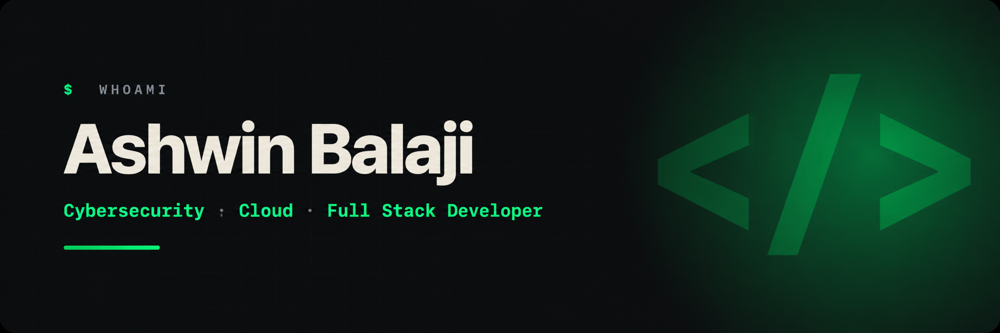

  

  
  &nbsp;&nbsp;
  
  &nbsp;&nbsp;
  

---

### Hello, I'm Ashwin Balaji!

I am an aspiring **Cybersecurity Engineer** and **Cloud Security Architect** currently studying at **Singapore Polytechnic**. I specialize in defensive security operations, hardening enterprise infrastructure, and automating network threat detection.

- 🎓 **Education**: Pursuing a Diploma in **Cybersecurity & Digital Forensics** at Singapore Polytechnic (2024 - 2027).
- 💼 **Professional Experience**: Currently interning as an **Operations Support System Engineer** at **NSL Ltd** (Singapore).
- 🛡️ **Defensive Security Focus**: Active Directory & System Hardening (GPOs, Linux PAM), network traffic auditing, SIEM log parsing.
- 📚 **Upskilling & Certifications**: Actively preparing for **CompTIA Security+**.

---

  

<table>
  <tr>
    <td>
      <b>💻 Languages</b> 
      
    </td>
  </tr>
  <tr>
    <td>
      <b>🛡️ Cybersecurity</b> 
      
      
      
      
      
      
      
    </td>
  </tr>
  <tr>
    <td>
      <b>🖥️ Systems & DevOps</b> 
      
       
      
      
      
      
    </td>
  </tr>
  <tr>
    <td>
      <b>🌐 Networking</b> 
      
    </td>
  </tr>
</table>

---

### 📊 GitHub Activity

  

---

  
    <i>"Security is not a product, but a process." — Bruce Schneier</i>
  

