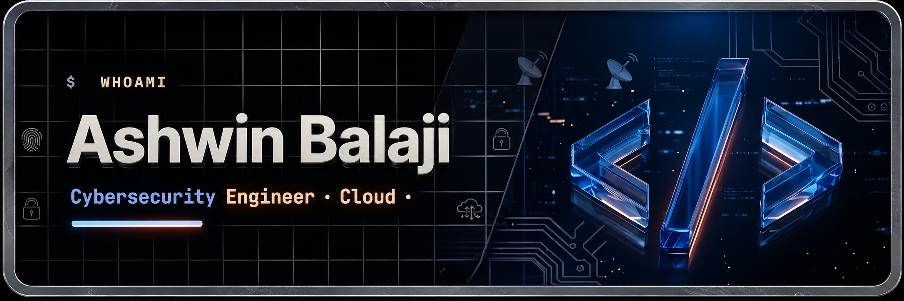

  

  
  
  

---

### 👋 Hello, I'm Ashwin Balaji!

I am an aspiring **Cybersecurity Engineer** and **Cloud Security Architect** currently studying at **Singapore Polytechnic**. I specialize in defensive security operations, hardening enterprise infrastructure, and automating network threat detection.

- 🎓 **Education**: Pursuing a Diploma in **Cybersecurity & Digital Forensics** at Singapore Polytechnic (2024 - 2027).
- 💼 **Professional Experience**: Currently interning as an **Operations Support System Engineer** at **NSL Ltd** (Singapore).
- 🛡️ **Defensive Security Focus**: Active Directory & System Hardening (GPOs, Linux PAM), network traffic auditing, SIEM log parsing.
- 📚 **Upskilling & Certifications**: Actively preparing for **CompTIA Security+** & **AWS Cloud Foundations**.

---

### 🛠️ Tech Stack & Cyber Security Toolkit

<table>
  <tr>
    <td valign="top" width="50%">
      <h4>💻 Languages & Core Admin</h4>
      
    </td>
    <td valign="top" width="50%">
      <h4>🛡️ Platforms & Security Systems</h4>
      
       
      <strong>DFIR & Analysis Tools:</strong>
      <ul>
        <li>Wireshark / Packet Capture Audits</li>
        <li>Splunk SIEM (Log Triage & Threat Monitoring)</li>
        <li>Volatility 3 & Autopsy (Digital Forensics)</li>
        <li>Ghidra & x64dbg (Reverse Engineering)</li>
        <li>Snort & Scapy (Network Intrusion Detection)</li>
      </ul>
    </td>
  </tr>
</table>

---

### 📊 GitHub Statistics

  
  &nbsp;&nbsp;
  

---

  
    <i>"Security is not a product, but a process." — Bruce Schneier</i>
  

